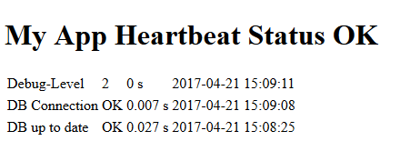
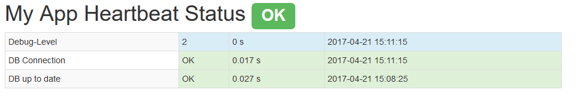
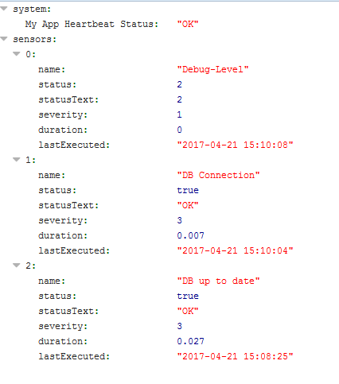

How to Use
==========

Controller
----------

The heartbeat status page can be accessed via /heartbeat, e.g. http://www.example.com/heartbeat or http://localhost/my_app/heartbeat.
It will display a table of all the registered and enabled sensors and their status, as well as the overall status of your application, based on the sum of all non-informational sensor statuses:

Or, if you use a basic bootstrap layout instead (see the [Configuration](Configuration.md) on how to change the layout):

The data can also be requested as JSON, e.g. for monitoring. Just append `.json` to the URL e.g. http://www.example.com/heartbeat.json:

To reset the cached sensor status results and to force to load the status page without caching, you can add ``?reset-cache=true`` to the URL, e.g. http://www.example.com/heartbeat?reset-cache=true.

Shell
-----

TODO Not yet implemented.

---

Back to the [Documentation](Home.md).
